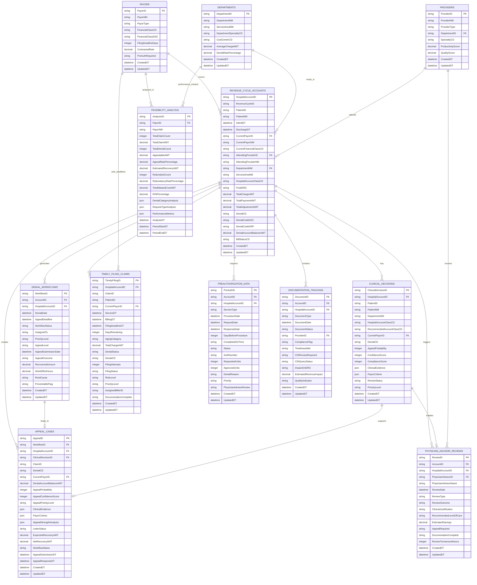

# Revenue Cycle Ecosystem Entity Relationship Diagram

## ERD Overview
This document describes the complete entity relationships for the integrated revenue cycle management system.



## Key Relationships

### Primary Entity: REVENUE_CYCLE_ACCOUNTS
The central entity that connects all revenue cycle processes:
- **One-to-Many** with Clinical Decisions, Denial Workflows, Appeals, Timely Filing
- **Many-to-One** with Payors, Departments, Providers

### Appeal Flow
1. `REVENUE_CYCLE_ACCOUNTS` → `DENIAL_WORKFLOWS` (when denial occurs)
2. `DENIAL_WORKFLOWS` → `APPEAL_CASES` (when appeal initiated)
3. `CLINICAL_DECISIONS` → `APPEAL_CASES` (provides supporting evidence)

### Clinical Decision Support Flow
1. `REVENUE_CYCLE_ACCOUNTS` → `CLINICAL_DECISIONS` (analysis triggered)
2. `CLINICAL_DECISIONS` → `PHYSICIAN_ADVISOR_REVIEWS` (when review needed)
3. `PHYSICIAN_ADVISOR_REVIEWS` → `APPEAL_CASES` (supports appeals)

### Timely Filing Management
- `TIMELY_FILING_CLAIMS` tracks each claim's filing status
- Links to `PAYORS` for deadline rules
- Links to `REVENUE_CYCLE_ACCOUNTS` for claim details

### Feasibility Analysis
- `FEASIBILITY_ANALYSIS` aggregates data by `PAYORS`
- Analyzes patterns across `DEPARTMENTS`
- Identifies optimization opportunities

## Data Flow Patterns

### 1. Denial to Appeal
```
Account → Denial Recorded → Workflow Created → Clinical Review → Appeal Generated → Letter Sent → Response Tracked
```

### 2. Preauthorization to Service
```
Service Scheduled → PreAuth Required → Request Submitted → Response Received → Service Delivered → Claim Filed
```

### 3. Documentation to Reimbursement
```
Service Provided → Documentation Created → CDI Review → Coding Assigned → Claim Submitted → Payment/Denial
```

### 4. Feasibility to Action
```
Historical Data → Payer Analysis → Opportunity Identification → Prioritization → Implementation → ROI Tracking
```

## Index Strategy

### Primary Keys
- All tables use surrogate keys (ID fields)
- Format: EntityTypeID (e.g., HospitalAccountID, AppealID)

### Foreign Key Indexes
- HospitalAccountID (most joined field)
- CurrentPayorID (payer analysis)
- DepartmentNM (department performance)
- WorkflowID (workflow tracking)

### Query Optimization Indexes
- Composite: (PayorID, DenialCD) for denial analysis
- Composite: (AgingCategory, PriorityLevel) for worklist
- Composite: (ServiceDT, FilingDeadlineDT) for deadline tracking
- Single: AppealProbability for high-value targeting

## Data Integrity Rules

### Referential Integrity
- All foreign keys must reference existing parent records
- Cascade updates for ID changes
- Restrict deletes for historical data

### Business Rules
1. **Appeal Creation**: Only denied accounts can have appeals
2. **Status Transitions**: Must follow defined workflow states
3. **Date Validations**: ServiceDT < BillingDT < FilingDeadlineDT
4. **Amount Validations**: DenialAmount <= TotalChargeAmount
5. **Probability Ranges**: All percentages 0-100

## Security Considerations

### PHI/PII Fields
- PatientID, PatientNM (encrypted at rest)
- ProviderNM (role-based access)
- Clinical evidence (audit logged)

### Audit Requirements
- All updates tracked with timestamps
- User actions logged
- Data changes versioned

## Performance Metrics

### Expected Volumes (Annual)
- Revenue Cycle Accounts: 45,000
- Clinical Decisions: 30,000
- Appeals: 5,500
- Timely Filing Claims: 12,000
- Feasibility Analyses: 60 (monthly × payers)

### Query Performance Targets
- Account lookup: <100ms
- Denial analysis: <500ms
- Feasibility report: <2s
- Bulk updates: <5s for 1000 records